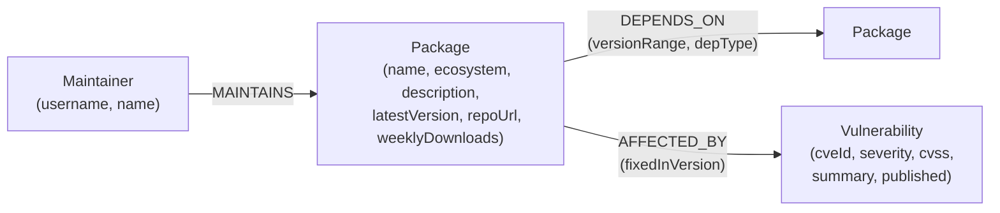

# DepRadius

**A dependency vulnerability blast-radius explorer, backed by CognoDB.**

Answer the question every engineering org eventually asks in a panic: *"We just found out `X` has a critical vulnerability — what do we actually run that depends on it, and how bad is it?"*

DepRadius models a software package ecosystem (packages, their dependencies, their maintainers, and their known vulnerabilities) as a graph, and lets you interactively trace how a single compromised package radiates outward through everything downstream of it.

> 📸 **Screenshots:** add 2–4 screenshots here (overview, blast-radius graph, vulnerability exposure) once you've run the app locally — see [Screenshots](#screenshots) below.
> 🔗 **Live demo:** _add your hosted demo link here before submitting_
> 🎥 **Screen recording:** _add your recording link here before submitting_

---

## Table of contents

- [Why a graph database?](#why-a-graph-database)
- [The use case](#the-use-case)
- [Data model](#data-model)
- [Project structure](#project-structure)
- [Setup: CognoDB Cloud](#setup-cognodb-cloud)
- [Setup: run it locally](#setup-run-it-locally)
- [The queries, explained](#the-queries-explained)
- [Engineering notes](#engineering-notes)
- [Deploying a hosted demo](#deploying-a-hosted-demo)
- [Screenshots](#screenshots)
- [Submission checklist](#submission-checklist)

---

## Why a graph database?

The core question DepRadius answers — *"what depends on this, transitively, and how many hops away is it?"* — is a **variable-length transitive closure over a mutable, potentially cyclic graph**. That's precisely the shape of query relational databases handle worst and graph databases handle natively:

| | Relational (SQL) | Graph (openCypher) |
|---|---|---|
| Model dependencies | A `depends_on(from_id, to_id)` join table | `(:Package)-[:DEPENDS_ON]->(:Package)` — the relationship *is* the data |
| "Everything that depends on X, any depth" | Recursive CTE, manually bounded, manual cycle-guarding (`UNION` self-referencing query, tracking a visited-set) | `MATCH (d)-[:DEPENDS_ON*1..6]->(target)` — one line |
| Shortest path between two packages | No native primitive in standard SQL; typically requires an external graph library or a hand-rolled BFS in application code | `shortestPath((a)-[:DEPENDS_ON*..15]-(b))` — built in |
| Detect circular dependencies | Self-join bounded by an *unknown* depth — awkward even with recursive CTEs, since you're looking for a path back to its own start | `MATCH (p)-[:DEPENDS_ON*2..8]->(p)` — the pattern *is* the cycle definition |
| "Which maintainers, combined, carry the largest downstream blast radius" | A join, a per-package recursive CTE, unioned across packages, then aggregated — three separate hard problems stacked on top of each other | One `MATCH` + `OPTIONAL MATCH` + `WITH`/aggregate pipeline |

None of this is exotic — dependency graphs, org charts, social graphs, and fraud rings all share the same shape: **entities connected by typed, directional relationships, where the interesting questions are about reachability, distance, and path structure, not about any single row.** A relational schema *can* represent this (as an edge table), but every query that matters has to fight the schema instead of using it. A graph database earns its place here because the storage model and the query language both speak "hops and paths" as first-class concepts.

## The use case

DepRadius seeds a small, realistically-shaped software ecosystem: 62 packages across npm and PyPI (55 with full metadata, plus 7 transitive leaf packages auto-created from dependency edges), 87 `DEPENDS_ON` relationships (with version ranges and dependency type), 11 illustrative vulnerabilities, and 18 maintainers. On top of that graph it offers five focused analyses:

1. **Blast radius** — given a package, find everything that depends on it, transitively, ranked by hop distance.
2. **Vulnerability exposure** — given a package, find every known vulnerability anywhere in its own dependency tree.
3. **Shortest path** — the shortest `DEPENDS_ON` chain connecting any two packages.
4. **Circular dependencies** — packages that transitively depend on themselves.
5. **Bus factor risk** — maintainers of one or two packages whose *combined* downstream blast radius is largest (a single person leaving would put a disproportionate amount of the ecosystem at risk).

This is a real, common problem (see: the `left-pad` incident, the `xz-utils` backdoor, every "supply chain security" vendor pitch deck) and it's one relational tooling structurally struggles with — which made it a good vehicle for showing what a graph database is actually for, rather than picking a use case where a graph is a stylistic choice.

**⚠️ Data note:** the seed dataset is synthetic and illustrative — realistic in shape (real package names, real-looking dependency chains) but the vulnerability records use `DEMO-` prefixed identifiers and are **not** real CVEs. This is a demo dataset, not a live feed. In a production version, the `Vulnerability` nodes would be populated by syncing the [OSV.dev](https://osv.dev) or GitHub Advisory Database APIs on a schedule instead of being hand-seeded.

## Data model



**Nodes**

| Label | Key property | Other properties |
|---|---|---|
| `Package` | `name` (unique) | `ecosystem`, `description`, `latestVersion`, `repoUrl`, `weeklyDownloads` |
| `Vulnerability` | `cveId` (unique) | `severity`, `cvss`, `summary`, `published`, `fixedInVersion` |
| `Maintainer` | `username` (unique) | `name` |

**Relationships**

| Type | Direction | Properties | Meaning |
|---|---|---|---|
| `DEPENDS_ON` | `(Package)-->(Package)` | `versionRange`, `depType` (`dependencies` / `devDependencies` / `peerDependencies`) | A depends on B |
| `AFFECTED_BY` | `(Package)-->(Vulnerability)` | `fixedInVersion` | A is affected by vulnerability V |
| `MAINTAINS` | `(Maintainer)-->(Package)` | — | Maintainer M maintains package P |

This is intentionally a small model — three labels, three relationship types — because the assignment is judged on whether the model earns its place, not on how many node types it has. `Vulnerability` and `Maintainer` are separate node types (rather than properties on `Package`) specifically because both participate in their own multi-hop queries (exposure walks *through* `AFFECTED_BY`; bus-factor risk aggregates *across* `MAINTAINS` combined with the dependency graph) — that's the test I used for "does this deserve to be a node."

## Project structure

```
depradius/
├── backend/                   Node.js / Express API
│   ├── src/
│   │   ├── server.js          App entrypoint, health check, graceful shutdown
│   │   ├── db/driver.js        CognoDB (Neo4j driver) connection + error types
│   │   ├── queries/cypher.js   Every Cypher query in the app, documented, parameterised
│   │   ├── routes/             packages.js (search/detail), graph.js (the 5 analyses)
│   │   └── middleware/         Central error handling (DB-unavailable -> 503, etc.)
│   ├── scripts/
│   │   ├── seed.js             Idempotent seed script (constraints + load + verify)
│   │   └── data/                Seed data, separated from load logic
│   └── .env.example
├── frontend/                  React (Vite) single-page app
│   └── src/
│       ├── App.jsx             Shell: sidebar + tabs + detail panel
│       ├── api.js              Thin fetch wrapper, one function per endpoint
│       └── components/         Sidebar, RadialBlastGraph, one component per analysis tab
└── docs/                       (optional) exported diagram images for the README
```

## Setup: CognoDB Cloud

1. Go to **[console.cognodb.com/signup](https://console.cognodb.com/signup)** and create a free account (no credit card required).
2. From the console, create a **free (`c0`) instance** and pick a region. Provisioning takes under a minute.
3. Copy the connection URI (`bolt+s://<instance-id>.databases.cognodb.cloud`) and the generated password for the `cognodb` user — **the password is shown exactly once**, so save it immediately (a password manager or your `.env` file, which is git-ignored).

## Setup: run it locally

Requires Node.js 18+.

```bash
git clone <your-repo-url> depradius
cd depradius
```

**1. Configure and seed the backend**

```bash
cd backend
npm install
cp .env.example .env
# edit .env: paste your COGNODB_URI and COGNODB_PASSWORD from the console
npm run seed        # loads 62 packages, 87 dependency edges, 11 vulnerabilities, 18 maintainers
npm run dev          # starts the API on http://localhost:4000
```

`npm run seed` is idempotent — it clears prior demo data and reloads fresh, so it's safe to re-run.

**2. Start the frontend**

```bash
cd ../frontend
npm install
npm run dev          # starts the app on http://localhost:5173, proxying /api to :4000
```

Open `http://localhost:5173`. If the backend isn't reachable, the UI shows a clear error state with a retry button rather than failing silently — see [Engineering notes](#engineering-notes).

## The queries, explained

All Cypher lives in one place — [`backend/src/queries/cypher.js`](backend/src/queries/cypher.js) — and every query is parameterised through the official driver (`session.run(cypher, params)`), never string-concatenated.

**1. Blast radius** (`blastRadiusQuery`) — the signature query:

```cypher
MATCH (target:Package {name: $name})
MATCH path = (dependent:Package)-[:DEPENDS_ON*1..6]->(target)
WITH dependent, min(length(path)) AS hops
RETURN dependent.name AS name, dependent.ecosystem AS ecosystem,
       dependent.latestVersion AS latestVersion, hops
ORDER BY hops ASC, name ASC
```

A variable-length, *reversed* traversal: instead of "what does X depend on," it asks "what depends on X, at any depth up to 6 hops." `min(length(path))` collapses multiple paths to the same dependent down to its shortest distance. The companion `blastRadiusEdgesQuery` fetches the edges *within* that result set so the UI can render an actual subgraph, not just a flat list.

**2. Vulnerability exposure** (`vulnerabilityExposureQuery`) — a forward traversal joined to `Vulnerability`:

```cypher
MATCH (root:Package {name: $name})
MATCH (root)-[:DEPENDS_ON*0..6]->(dep:Package)-[:AFFECTED_BY]->(vuln:Vulnerability)
RETURN DISTINCT dep.name AS packageName, vuln.cveId AS cveId, vuln.severity AS severity, ...
ORDER BY CASE vuln.severity WHEN 'CRITICAL' THEN 0 ... END, packageName ASC
```

Walks *into* a package's own dependency tree (not out of it, like blast radius) and joins each node in that tree against its known vulnerabilities — "everything wrong with what I depend on," ranked by severity.

**3. Shortest path** (`SHORTEST_PATH`):

```cypher
MATCH (a:Package {name: $from}), (b:Package {name: $to})
MATCH p = shortestPath((a)-[:DEPENDS_ON*..15]-(b))
RETURN [n IN nodes(p) | n.name] AS pathNames, length(p) AS hops
```

`shortestPath()` is a built-in Cypher primitive with no relational equivalent — most SQL engines have no shortest-path operator at all.

**4. Circular dependencies** (`FIND_CYCLES`):

```cypher
MATCH path = (p:Package)-[:DEPENDS_ON*2..8]->(p)
RETURN [n IN nodes(path) | n.name] AS cycle, length(path) AS cycleLength
```

A path pattern that starts and ends at the *same* node, bound `2..8` hops (`*1` would just be a self-loop). The seed data includes one deliberate synthetic cycle (`plugin-host-core` → `plugin-host-devtools` → `plugin-host-cli` → `plugin-host-core`) to demonstrate this — peer-dependency cycles of exactly this shape do happen in real registries.

**5. Bus factor risk** (`busFactorQuery`) — the most structurally complex query, combining a join with a per-node transitive closure and an aggregate:

```cypher
MATCH (m:Maintainer)-[:MAINTAINS]->(p:Package)
OPTIONAL MATCH (dependent:Package)-[:DEPENDS_ON*1..6]->(p)
WITH m, p, count(DISTINCT dependent) AS blastRadius
WITH m, collect({package: p.name, blastRadius: blastRadius}) AS packages,
     sum(blastRadius) AS totalBlastRadius, count(DISTINCT p) AS packageCount
WHERE packageCount <= 2
RETURN m.username AS maintainer, packageCount, totalBlastRadius, packages
ORDER BY totalBlastRadius DESC
```

For every maintainer, computes the blast radius of *each* package they maintain, then aggregates across all of them — restricted to maintainers of one or two packages, so the result surfaces concentrated risk rather than prolific maintainers who are individually diversified.

**A note on parameterising hop bounds:** Cypher allows parameters for property values (`{name: $name}`) but not for the numeric bound of a variable-length pattern (`*1..$n` is not valid Cypher). `maxHops` is therefore validated server-side as a clamped positive integer (`safeHops()` in `routes/graph.js`, capped at 10) before being interpolated into the query template — every other value in every query remains a bound parameter.

## Engineering notes

- **Connection details** are read exclusively from environment variables (`COGNODB_URI`, `COGNODB_USER`, `COGNODB_PASSWORD`) via `dotenv`; `.env` is git-ignored in both `backend/` and `frontend/`, and `.env.example` files document the required shape without real values.
- **Error handling**: if CognoDB is unreachable, the driver module surfaces a `DbUnavailableError` that the central error-handling middleware turns into a `503` with an actionable message, both at server startup (logged) and per-request. The frontend surfaces this as a real error state with a retry button — it never fails silently or shows a blank screen.
- **Parameterised queries** throughout — see [The queries, explained](#the-queries-explained).
- **Idempotent seeding** — `npm run seed` can be re-run safely; it clears prior demo nodes/relationships and reloads from the same source files.

## Deploying a hosted demo

Any free tier works. A straightforward pairing:

- **Backend** → [Render](https://render.com) or [Railway](https://railway.app): new Web Service from your repo, root directory `backend`, build command `npm install`, start command `npm start`, and set the `COGNODB_URI` / `COGNODB_USER` / `COGNODB_PASSWORD` / `CORS_ORIGIN` environment variables in the dashboard (never in the repo).
- **Frontend** → [Vercel](https://vercel.com) or [Netlify](https://netlify.com): new project from your repo, root directory `frontend`, build command `npm run build`, output directory `dist`, and set `VITE_API_BASE_URL` to your deployed backend's URL.

Remember to keep your CognoDB instance running until you hear back, per the assignment's instructions.

